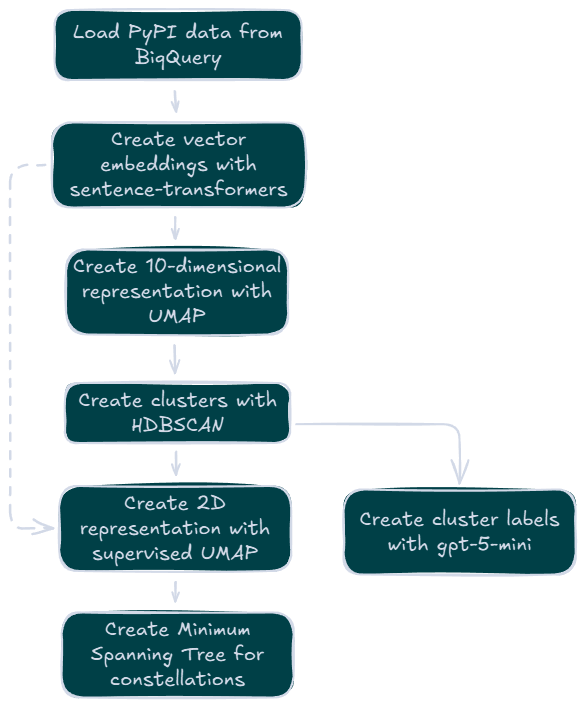

# PyAtlas

  

  <strong>👉 <a href="https://pyatlas.io">Explore the map at pyatlas.io</a></strong>

## What does this do?

[PyAtlas](https://pyatlas.io) is an interactive map of the top 10,000 Python packages on [PyPI](https://pypi.org/). Packages with similar functionality are positioned close together, making it easy to discover alternatives or related tools. It’s mainly just a fun tech demo and hobby project, but it can also be a handy way to discover useful packages. For example, if you want to find packages similar to `matplotlib`, you can locate it on the map and explore the packages clustered around it.

## How does this work?

The project collects descriptions for the most popular packages on PyPI. These descriptions are converted into vector embeddings using [Sentence Transformers](https://www.sbert.net/). The high-dimensional embeddings are then reduced to 10 dimensions using [UMAP](https://umap-learn.readthedocs.io/), and packages are grouped into clusters using [HDBSCAN](https://hdbscan.readthedocs.io/). A second UMAP reduction creates the final 2D coordinates for visualization, using the cluster labels to keep similar packages together. Finally, cluster labels are generated using [OpenAI's](https://openai.com/) `gpt-5-mini` to describe each group.

 

  

## Stack

The project uses the following technologies:

1. **[React](https://react.dev/)** with **[Three.js](https://threejs.org/)** for the interactive visualization
2. **[Sentence Transformers](https://www.sbert.net/)** for vector embeddings
3. **[UMAP](https://umap-learn.readthedocs.io/)** for dimensionality reduction
4. **[HDBSCAN](https://hdbscan.readthedocs.io/)** for clustering
5. **[OpenAI](https://openai.com/)** for generating cluster labels

## Development

See [development.md](./DEVELOPMENT.md)

## Data

The dataset for this project is created using the [PyPI dataset on Google BigQuery](https://console.cloud.google.com/marketplace/product/gcp-public-data-pypi/pypi). The SQL query used can be found in [pypi_bigquery.sql](./pypi_bigquery.sql).
